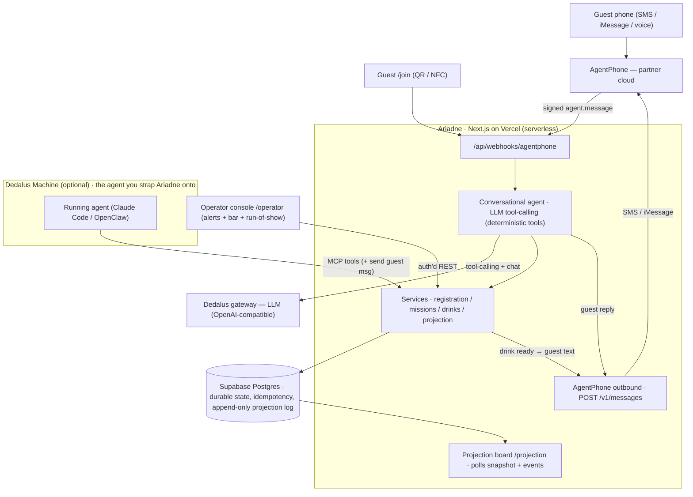

# Ariadne

**Your personal agent for the night.** A phone-first event backbone you strap onto
a running agent (Claude Code, OpenClaw, or AgentPhone hosted) so it can host a
live event end-to-end: check guests in, assign color gems and secret words, issue
labyrinth missions, take free drink orders, and drive a projected room board.

Built for **Run(way)time** — Dedalus's tech-merch runway × AI × art × HCI brand
experience at Lume Studios. Daedalus built the labyrinth; **Ariadne** knows the way
through it and guides each guest. The mission set is literally the *Dedalus
Labyrinth*, and the orchestration layer connects agent ↔ phone ↔ missions ↔
projection.

> Partner: **AgentPhone** is the confirmed phone/SMS/voice surface. Fuser
> (creative/projection visuals) is intentionally **not** a runtime dependency in
> this build — the projection board is a self-contained Ariadne frontend.

---

## What it does (scenario-first)

| Scenario | Priority | Status |
|---|---|---|
| 1. Arrival + personal-agent check-in | **P0** | ✅ live (gem + secret word + game id + first mission) |
| 2. Free drink ordering through the agent | **P0** | ✅ live (parse → bar queue → operator status → guest ping) |
| 3. Dedalus Labyrinth missions | **P1** | ✅ color quest, word match, clue, puzzle — deterministic validation |
| 4. Live projection board + tiles | **P1** | ✅ live polling board, ranks, fade/restore, operator scenes |
| 5. Fuser room visuals | P1 | ⏸ asset registry stubbed; runtime out of scope (AgentPhone only) |
| 6. Photo / fit battle | P1 cond. | ⏸ media plumbing present; Fuser runtime out of scope |
| 7. Merch try-on | P1 cond. | ⏸ out of scope |

The non-negotiable cutline (phone-only join, agent check-in + first mission,
drink flow, mission loop over text, real-time board) is **fully implemented and
tested**, including a live signed round-trip against the AgentPhone API.

---

## Architecture

Ariadne runs as **Next.js on Vercel** (serverless functions) backed by **Supabase
Postgres**. State lives in the managed database, so every function invocation —
the webhook, the operator console, a strap-on agent — sees the same source of
truth, and the room has an always-on phone number with no machine to babysit.



**What each piece is**

- **Postgres backbone (Supabase)** — the single source of truth for all event
  state (participants, conversations, the idempotency log, missions, drink orders,
  and the append-only projection event log). Reached over the Supabase transaction
  pooler via `pg`; the test suite runs the same SQL against in-memory `pglite`, so
  one dialect is exercised everywhere.
- **Conversational agent** — *ours*, an in-process LLM tool-calling loop over the
  **Dedalus gateway**. It routes and chats; the bounded **tools** (`check_in`,
  `order_drink`, `answer_mission`, `get_status`, `flag_operator`) run the
  deterministic services, so pass/fail and menu-matching can't be talked around.
  The system prompt + lore (Dedalus / venue / run-of-show / menu) + the guest's
  grounded state are injected each turn.
- **Running agent (Dedalus Machine)** — the *optional* LLM agent (Claude Code,
  OpenClaw) you strap Ariadne onto via MCP. It supervises/drives the room through
  the same services and sends guest messages through the same outbound path.
- **Operator console `/operator`** — the token-gated staff surface: a **bar queue**
  (move drinks queued → in_progress → ready → picked_up; marking *ready* texts the
  guest via AgentPhone outbound), **run-of-show** (change projection scene,
  fade/restore a guest), an **alerts panel** (`flag_operator` escalations), and the
  **roster** (every participant + secret word for force-completes). Live overrides,
  because event systems fail in boring ways.
- **Projection board `/projection`** — the big-screen client loads a full **snapshot**
  from `/api/projection/state`, then polls `/api/projection/events?since=<seq>` every
  ~1.5s for new events (check-in, score, elimination, scene), advancing by sequence
  number, and re-fetches the snapshot every 15s to self-heal. Postgres is
  authoritative, so a dropped poll recovers on the next tick. Reload-safe.

**Layers** (`src/`): `constants/` (event content: gems, drinks, missions,
prompts, lore), `domain/` (pure logic: parsers, assignment, types), `server/db/`
(schema, the `Db` adapter over `pg`/`pglite`, and repositories on a
`BaseRepository`), `server/services/` (registration, missions, drinks,
projection), `server/agent/` (the tool-calling brain + runner + tools),
`server/partners/` (AgentPhone + Dedalus: verify, normalize, thin REST clients,
outbound), `app/` (routes + UIs), `mcp/` (the strap-on server).

Every guest becomes a canonical `participant_id` at check-in; phone / conversation
ids are identifiers attached to it. Every inbound partner event is normalized to
an `InteractionEvent` before it mutates state, and persisted once
(idempotent by `X-Webhook-ID`). Projection is an append-only event log; the board
recovers full state from `GET /api/projection/state` on any reload.

---

## Quickstart

```bash
pnpm install
cp .env.example .env.local      # set SUPABASE_DB_URL, AGENTPHONE_API_KEY, DEDALUS_API_KEY + tokens
pnpm migrate                    # apply the schema to your Supabase Postgres
pnpm test                       # 20 tests (parsers, assignment, signature, agent + full E2E on pglite)
pnpm seed                       # populate demo participants/missions/drinks (via the live brain)
pnpm dev                        # http://localhost:3939  (/  /join  /projection  /operator)
```

Operator console token = `ARIADNE_OPERATOR_TOKEN`.

### Deploy (always-on)

Ariadne ships on **Vercel** (project `ariadne`, alias
`https://ariadne-runway.vercel.app`) against the Supabase **Ariadne** project:

```bash
vercel link --project ariadne   # once
pnpm migrate                    # ensure the Supabase schema is current
vercel --prod                   # deploy (CLI uploads the working dir)
pnpm provision --no-number      # point the AgentPhone agent webhook at the deployed URL
```

The same env vars live in the Vercel project (`SUPABASE_DB_URL`, `DEDALUS_*`,
`AGENTPHONE_*`, operator/agent tokens). `ARIADNE_PUBLIC_BASE_URL` falls back to
`VERCEL_URL` but is pinned to the alias so QR/join links and the webhook stay
stable. Re-pointing the webhook rotates the signing secret — sync the new
`AGENTPHONE_WEBHOOK_SECRET` into Vercel and redeploy.

To push **only** a prompt/copy edit (system prompt, begin message) to the live
AgentPhone agent without re-pointing the webhook or rotating that secret, run
`pnpm provision:prompt` (alias for `pnpm provision --prompt-only`).

### Local phone testing

```bash
pnpm tunnel                     # cloudflared → https://<sub>.trycloudflare.com
# point ARIADNE_PUBLIC_BASE_URL at the tunnel, then:
pnpm provision                  # agent + number + per-agent webhook (writes signing secret)
pnpm simulate --text "vodka soda" --from +15555550123   # signed inbound, no real phone
```

Outbound SMS needs 10DLC; **iMessage outbound works without it**, and the operator
queue + board run regardless.

---

## AgentPhone integration notes

- **Auth**: `Authorization: Bearer <key>`, base `https://api.agentphone.ai/v1`.
- **Inbound**: `agent.message` (channels `sms`/`mms`/`imessage`/`voice`) → our
  webhook. Verified by HMAC over `{timestamp}.{rawBody}` (`X-Webhook-Signature`),
  5-minute replay window, idempotent by `X-Webhook-ID`.
- **Outbound** (the PRD's open question, resolved): `POST /v1/messages`
  (`{ agent_id, to_number, body, media_urls? }`). SMS webhooks only `200`; replies
  go out via this endpoint.
- **Voice**: guests can **call the number** — AgentPhone transcribes and posts a
  `voice` turn to the webhook; we stream an interim line immediately (NDJSON), then
  the brain's spoken reply, so the caller never hits silence while the tool loop
  runs. Free plan = **1 concurrent call**, so text stays primary.
- **State mirror**: `PATCH /v1/conversations/{id}` reflects `participant_id` /
  flow / mission back onto the AgentPhone conversation.

We hand-roll a thin typed client (`server/partners/agentphone/client.ts`) for full
control of error paths on an event-critical surface. The official `agentphone`
npm SDK and the docs MCP server are valid alternatives.

---

## Strap onto a running agent (MCP)

`pnpm mcp` starts a stdio MCP server exposing the backbone as tools
(`ariadne_register_participant`, `ariadne_take_drink_order`,
`ariadne_submit_mission_answer`, `ariadne_send_guest_message`,
`ariadne_projection`, …) plus `ariadne_get_system_prompt` (the rigorous persona).
See [`skill/SKILL.md`](skill/SKILL.md). The built-in conversational brain handles
the SMS/voice path on its own; a strap-on agent supervises and drives the room.

---

## Endpoints

| Method · Path | Purpose |
|---|---|
| `POST /api/webhooks/agentphone` | inbound messages/voice (signed) |
| `POST /api/participants/register` | web/QR check-in |
| `GET /api/projection/state` | full board snapshot |
| `GET /api/projection/events?since=<seq>` | incremental projection events (board poll) |
| `GET /api/operator/drink-orders` · `PATCH …/{id}` | bar queue (auth) |
| `GET /api/operator/participants` | roster (auth) |
| `GET /api/operator/alerts` · `PATCH …/{id}` | operator escalations (auth) |
| `POST /api/operator/projection` | scene / eliminate / restore / emit (auth) |

## Data model

`participants`, `conversations`, `partner_events` (idempotency), `missions` →
`participant_missions` → `mission_events`, `drink_orders` → `drink_order_events`,
`projection_events` (append-only), `fuser_assets` (stub). See
`src/server/db/schema.ts`.

## Resilience (by design, per PRD)

Outbound is best-effort: the operator queue and projection board keep the room
running if AgentPhone outbound is constrained. Voice degrades to text with no dead
end. The board recovers full state on reload. Operators can override live (fade /
restore / scene). Mission pass/fail is deterministic, never an LLM guess.
