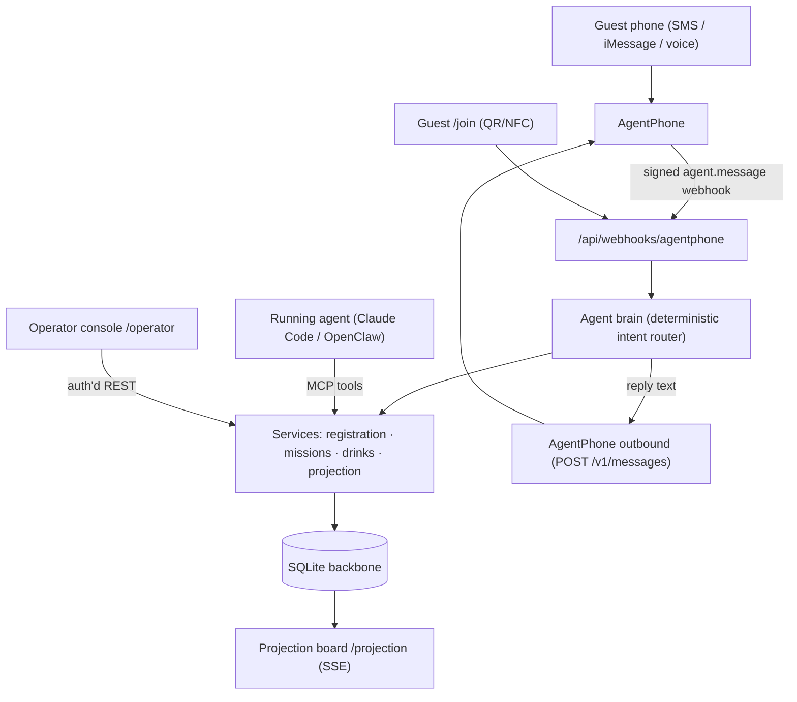

# Ariadne

**The thread through the labyrinth.** A phone-first event backbone you strap onto
a running agent (Claude Code, OpenClaw, or AgentPhone hosted) so it can host a
live event end-to-end: check guests in, assign color gems and secret words, issue
labyrinth missions, take free drink orders, and drive a projected room board.

Built for **Run(way)time** — Dedalus's tech-merch runway × AI × art × HCI brand
experience at Lume Studios. Daedalus built the labyrinth; **Ariadne** is the
thread that guides you through it. The mission set is literally the *Dedalus
Labyrinth*, so the orchestration layer that connects agent ↔ phone ↔ missions ↔
projection is the thread.

> Partner: **AgentPhone** is the confirmed phone/SMS/voice surface. Fuser
> (creative/projection visuals) is intentionally **not** a runtime dependency in
> this build — the projection board is a self-contained Ariadne frontend.

---

## What it does (scenario-first)

| Scenario | Priority | Status |
|---|---|---|
| 1. Arrival + personal-agent check-in | **P0** | ✅ live (gem + secret word + game id + first mission) |
| 2. Free drink ordering through the agent | **P0** | ✅ live (parse → bar queue → operator status → guest ping) |
| 3. Dedalus Labyrinth missions | **P1** | ✅ color quest, word match, clue, puzzle — deterministic validation |
| 4. Live projection board + tiles | **P1** | ✅ SSE board, ranks, fade/restore, operator scenes |
| 5. Fuser room visuals | P1 | ⏸ asset registry stubbed; runtime out of scope (AgentPhone only) |
| 6. Photo / fit battle | P1 cond. | ⏸ media plumbing present; Fuser runtime out of scope |
| 7. Merch try-on | P1 cond. | ⏸ out of scope |

The non-negotiable cutline (phone-only join, agent check-in + first mission,
drink flow, mission loop over text, real-time board) is **fully implemented and
tested**, including a live signed round-trip against the AgentPhone API.

---

## Architecture

One Next.js app (self-hosted, behind a tunnel so AgentPhone can reach the
webhook) over durable local SQLite. One shared backbone; partners and the agent
plug into it.



**Layers** (`src/`): `constants/` (event content: gems, drinks, missions,
prompts), `domain/` (pure logic: intent, parsers, assignment, types),
`server/db/` (schema + repositories over a `BaseRepository`), `server/services/`
(registration, missions, drinks, projection, event-bus), `server/agent/` (the
deterministic brain), `server/partners/agentphone/` (verify, normalize, thin REST
client, outbound), `app/` (routes + UIs), `mcp/` (the strap-on server).

Every guest becomes a canonical `participant_id` at check-in; phone / conversation
ids are identifiers attached to it. Every inbound partner event is normalized to
an `InteractionEvent` before it mutates state, and persisted once
(idempotent by `X-Webhook-ID`). Projection is an append-only event log; the board
recovers full state from `GET /projection/state` on any reload.

---

## Quickstart

```bash
pnpm install
cp .env.example .env.local      # set AGENTPHONE_API_KEY + tokens
pnpm test                       # 24 tests (parsers, intent, assignment, signature, full E2E)
pnpm seed                       # populate demo participants/missions/drinks
pnpm dev                        # http://localhost:3939  (/  /join  /projection  /operator)
```

Operator console token = `ARIADNE_OPERATOR_TOKEN`.

### Go live with a real phone line

```bash
# 1. expose the local server so AgentPhone can reach the webhook
pnpm tunnel                     # cloudflared → https://<sub>.trycloudflare.com
# 2. point the public URL at the tunnel in .env.local, then:
pnpm provision                  # creates the "Ariadne · Run(way)time" agent,
                                # provisions a number, sets a per-agent webhook,
                                # and writes ids + signing secret to .env.local
pnpm start                      # restart so the new secret is loaded
pnpm smoke                      # triggers a real signed test webhook → expects 200
pnpm simulate --text "vodka soda" --from +15555550123   # local signed inbound
```

`pnpm provision --no-number` configures the agent + webhook without buying a
number (handy for testing the signed loop). Outbound SMS needs 10DLC; **iMessage
outbound works without it**, and the operator queue + board run regardless.

---

## AgentPhone integration notes

- **Auth**: `Authorization: Bearer <key>`, base `https://api.agentphone.ai/v1`.
- **Inbound**: `agent.message` (channels `sms`/`mms`/`imessage`/`voice`) → our
  webhook. Verified by HMAC over `{timestamp}.{rawBody}` (`X-Webhook-Signature`),
  5-minute replay window, idempotent by `X-Webhook-ID`.
- **Outbound** (the PRD's open question, resolved): `POST /v1/messages`
  (`{ agent_id, to_number, body, media_urls? }`). SMS webhooks only `200`; replies
  go out via this endpoint.
- **Voice**: webhook returns `{ "text": ... }` inline. Web/iPad voice mints a
  30-second token via `POST /v1/calls/web`. Free plan = **1 concurrent call**, so
  voice is the premium/optional path and text is primary.
- **State mirror**: `PATCH /v1/conversations/{id}` reflects `participant_id` /
  flow / mission back onto the AgentPhone conversation.

We hand-roll a thin typed client (`server/partners/agentphone/client.ts`) for full
control of error paths on an event-critical surface. The official `agentphone`
npm SDK and the docs MCP server are valid alternatives.

---

## Strap onto a running agent (MCP)

`pnpm mcp` starts a stdio MCP server exposing the backbone as tools
(`ariadne_register_participant`, `ariadne_take_drink_order`,
`ariadne_submit_mission_answer`, `ariadne_send_guest_message`,
`ariadne_projection`, …) plus `ariadne_get_system_prompt` (the rigorous persona).
See [`skill/SKILL.md`](skill/SKILL.md). The default deterministic brain handles the
fast <3s SMS path on its own; a strap-on agent supervises and drives the room.

---

## Endpoints

| Method · Path | Purpose |
|---|---|
| `POST /api/webhooks/agentphone` | inbound messages/voice (signed) |
| `POST /api/participants/register` | web/QR check-in |
| `POST /api/agentphone/web-call-token` | mint web-voice token |
| `GET /api/projection/state` | full board snapshot |
| `GET /api/projection/stream` | SSE projection events |
| `GET /api/operator/drink-orders` · `PATCH …/{id}` | bar queue (auth) |
| `GET /api/operator/participants` | roster (auth) |
| `POST /api/operator/projection` | scene / eliminate / restore / emit (auth) |

## Data model

`participants`, `conversations`, `partner_events` (idempotency), `missions` →
`participant_missions` → `mission_events`, `drink_orders` → `drink_order_events`,
`projection_events` (append-only), `fuser_assets` (stub). See
`src/server/db/schema.ts`.

## Resilience (by design, per PRD)

Outbound is best-effort: the operator queue and projection board keep the room
running if AgentPhone outbound is constrained. Voice degrades to text with no dead
end. The board recovers full state on reload. Operators can override live (fade /
restore / scene). Mission pass/fail is deterministic, never an LLM guess.
